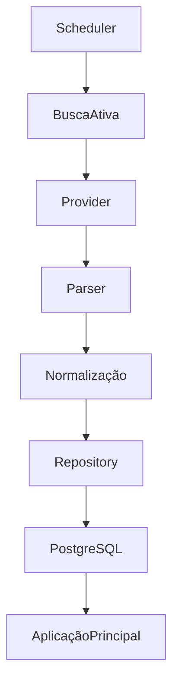
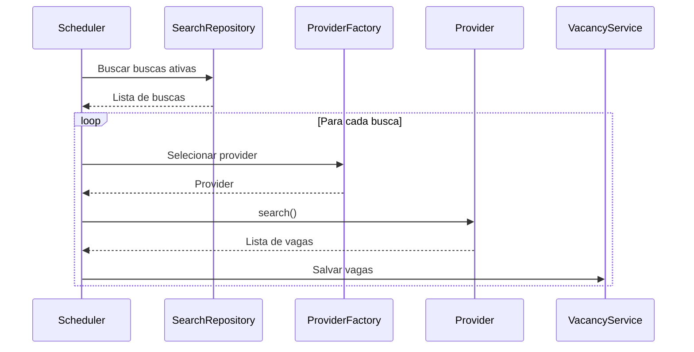
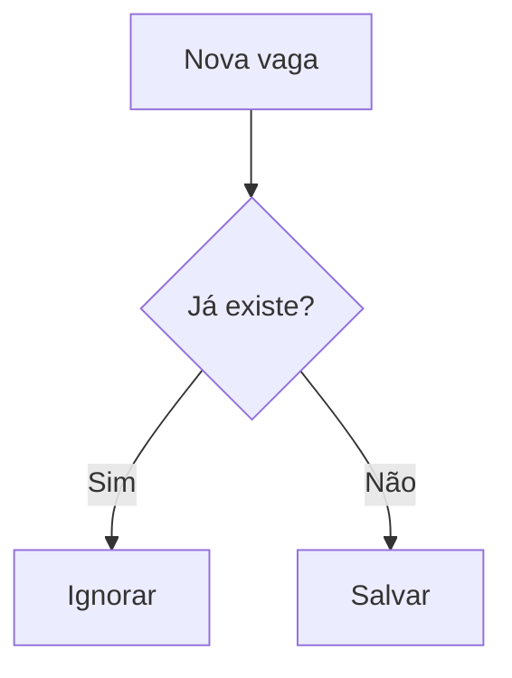
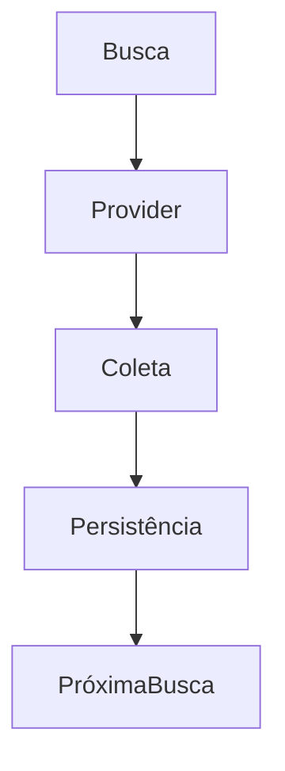
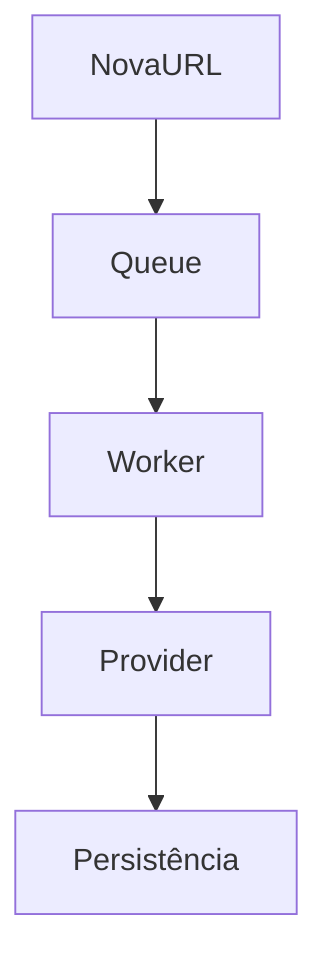
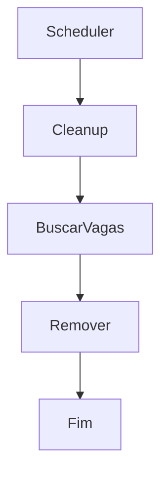
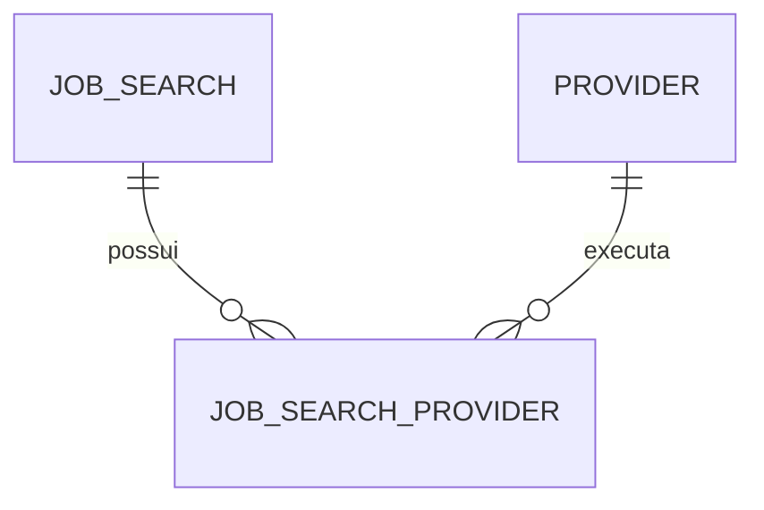

# Product Requirements Document (PRD)

# Job Scraper Service

**Versão:** 1.0.0

**Status:** Em Desenvolvimento

**Autor:** Equipe do Projeto

**Data:** Julho/2026

---

# Histórico de versões

| Versão | Data | Autor | Descrição |
|---------|------|--------|-----------|
|1.0.0|Julho/2026|Equipe Projeto|Primeira versão do documento|

---

# Sumário

1. [Visão Geral](#1-visão-geral)
2. [Objetivos](#2-objetivos)
3. [Escopo](#3-escopo)
4. [Fora do Escopo](#4-fora-do-escopo)
5. [Stakeholders](#5-stakeholders)
6. [Glossário](#6-glossário)
7. [Arquitetura Geral](#7-arquitetura-geral)
8. [Fluxo Geral](#8-fluxo-geral)
9. [Princípios da Arquitetura](#9-princípios-da-arquitetura)
10. [Arquitetura Técnica](#10-arquitetura-técnica)
11. [Estrutura do Projeto](#11-estrutura-do-projeto)
12. [Stack Tecnológica](#12-stack-tecnológica)
13. [Configurações da Aplicação)](#13-configurações-da-aplicação)
14. [Padrões Arquiteturais](#14-padrões-arquiteturais)
15. [Fluxo de Execução](#15-fluxo-de-execução)
16. [Scheduler](#16-scheduler)
17. [Execução Paralela](#17-execução-paralela)
18. [Retry](#18-retry)
19. [Delay entre Requisições](#19-delay-entre-requisições)
20. [logging](#20-logging)
21. [API Interna](#21-api-interna)
22. [Tratamento de Erros](#22-tratamento-de-erros)
23. [Modelo de Dados](#23-modelo-de-dados)
24. [Entidades](#24-entidades)
25. [Tabela Jobsearch](#25-tabela-jobsearch)
26. [Tabela Vacancy](#26-tabela-vacancy)
27. [Regras de Persistência](#27-regras-de-persistência)
28. [Busca Compartilhada](#28-busca-compartilhada)
29. [Diferenças  entre  Providers](#29-diferenças-entre-providers)
30. [Busca  Manual  por  URL](#30-busca-manual-por-url)
31. [Scheduler](#31-scheduler)
32. [Regras  de  Negócio](#32-regras-de-negócio)
33. [Limpeza  Automática](#33-limpeza-automática)
34. [Critérios  de  Aceitação](#34-critérios-de-aceitação)
35. [Modelo  de  Busca  Compartilhada](#35-modelo-de-busca-compartilhada)
36. [Relacionamento  entre  Buscas  e  Providers](#36-relacionamento-entre-buscas-e-providers)
37. [Fluxo  do  Scheduler](#37-fluxo-do-scheduler)
38. [Requisitos  Funcionais](#38-requisitos-funcionais)
39. [Requisitos  não  Funcionais](#39-requisitos-não-funcionais)
40. [Casos  de  Uso](#40-casos-de-uso)
41. [Estratégia  de  Testes](#41-estratégia-de-testes)
42. [Boas  Práticas](#42-boas-práticas)
43. [Roadmap](#43-roadmap)
44. [Planejamento  do  Desenvolvimento](#44-planejamento-do-desenvolvimento)
45. [Plano  de  Implementação](#45-plano-de-implementação)
46. [Critérios  gerais  de  Conclusão](#46-critérios-gerais-de-conclusão)
47. [Roadmap pós  Versão  1](#47-roadmap-pós-versão-1)
48. [Considerações Finais](#48-considerações-finais)

---

# 1. Visão Geral

## Objetivo

Desenvolver um serviço independente responsável por realizar a coleta de vagas de emprego em diferentes plataformas, normalizar os dados obtidos e armazená-los em um banco PostgreSQL.

O serviço será consumido por uma aplicação externa responsável por gerenciamento de usuários, buscas e candidaturas.

Este projeto **não possui interface gráfica**, autenticação ou gerenciamento de usuários.

Seu único objetivo é realizar scraping de vagas e persistir as informações.

---

## Motivação

Evitar que múltiplos usuários realizem buscas duplicadas em plataformas de emprego.

Ao invés de executar a mesma pesquisa diversas vezes, o sistema realizará uma única coleta para cada combinação de parâmetros cadastrada.

Exemplo:

```
Keyword:
Analista de Dados

Estado:
RJ

Município:
Rio de Janeiro
```

Mesmo que milhares de usuários tenham interesse nesta busca, ela será executada apenas uma vez.

---

# 2. Objetivos

## Objetivos principais

- Centralizar a coleta de vagas.
- Reduzir consultas repetidas.
- Facilitar expansão para novos provedores.
- Manter arquitetura desacoplada.
- Persistir vagas normalizadas.
- Permitir buscas automáticas.
- Permitir busca manual por URL.
- Possibilitar integração com outras aplicações.

---

## Objetivos secundários

- Alta organização do código.
- Fácil manutenção.
- Fácil inclusão de novos Providers.
- Execução paralela.
- Baixo consumo de memória.
- Logs completos.
- Escalabilidade.

---

# 3. Escopo

A primeira versão contemplará:

## Providers

- LinkedIn
- Gupy

---

## Funcionalidades

- Busca compartilhada
- Busca manual por URL
- Persistência das vagas
- Scheduler
- Retry automático
- Rate Limiting
- Logs
- API interna
- Health Check
- Métricas
- Limpeza automática de vagas

---

## Banco

PostgreSQL

---

## ORM

SQLAlchemy 2.x

---

## Migrações

Alembic

---

## API

FastAPI

---

## Execução Paralela

asyncio

aiohttp

---

## Parser HTML

BeautifulSoup4

---

## Logging

Loguru

---

## Ambiente

uv (Astral)

---

## Qualidade

Ruff
Mypy

---

# 4. Fora do Escopo

Este projeto NÃO será responsável por:

- Cadastro de usuários
- Login
- Cadastro
- Gestão de candidaturas
- Tela de vagas
- Interface Web
- Aplicação Mobile
- Envio de e-mails
- Notificações
- Recomendação de vagas

Todas essas responsabilidades pertencem à aplicação principal.

---

# 5. Stakeholders

## Aplicação Principal

Responsável por:

- Cadastro dos usuários
- Cadastro das buscas
- Gestão das candidaturas
- Consumo das vagas

---

## Job Scraper Service

Responsável por:

- Buscar vagas
- Normalizar dados
- Persistir informações
- Atualizar banco

---

## Banco PostgreSQL

Responsável por armazenar:

- Buscas
- Vagas
- Histórico

---

# 6. Glossário

| Termo         |                    Definição                                      |
|-------------- |------------------------------------------------------------------ |
|Provider       |Implementação responsável por integrar uma plataforma específica   |
|Search         |Busca cadastrada                                                   |
|Scheduler      |Serviço responsável por iniciar as coletas automaticamente         | 
|Job            |Vaga de emprego                                                    |
|External ID    |Identificador da vaga no provedor                                  |
|Repository     |Camada responsável pela persistência                               |
|Service        |Camada de regra de negócio                                         |

---

# 7. Arquitetura Geral

```text
                  Aplicação Principal
                           │
                           │
                           ▼
                   PostgreSQL
                           ▲
                           │
                           │
                 Job Scraper Service
                           │
        ┌──────────────────┴─────────────────┐
        │                                    │
        ▼                                    ▼
 LinkedIn Provider                   Gupy Provider
 BeautifulSoup                         Requests/API
```

---

## Componentes

### Scheduler

Executa automaticamente todas as buscas cadastradas.

---

### Search Service

Responsável por recuperar as buscas ativas.

---

### Provider Factory

Seleciona automaticamente qual Provider será utilizado.

---

### Providers

Cada plataforma possuirá sua implementação independente.

Exemplo:

```
LinkedInProvider

GupyProvider
```

Todos deverão implementar a mesma interface.

---

### Vacancy Service

Responsável por:

- Validar vagas
- Remover duplicidade
- Persistir dados

---

### Repository

Responsável pelo acesso ao banco.

Toda persistência deverá ocorrer através desta camada.

---

# 8. Fluxo Geral



---

# 9. Princípios da Arquitetura

O sistema deverá seguir os seguintes princípios:

- Baixo acoplamento
- Alta coesão
- Separação de responsabilidades
- SOLID
- Clean Architecture (adaptada)
- Repository Pattern
- Provider Pattern
- Service Layer
- Configuração centralizada
- Código orientado à extensibilidade

---

## Estratégia de Expansão

Novos provedores deverão ser adicionados sem necessidade de alterar o núcleo do sistema.

Exemplo:

```
IndeedProvider

InfoJobsProvider

CathoProvider

VagasProvider
```

Cada novo provider deverá implementar apenas a interface base.

---

# 10. Arquitetura Técnica

## Visão Geral

O Job Scraper Service será uma aplicação independente desenvolvida em Python, responsável exclusivamente pela coleta, normalização e persistência de vagas.

A arquitetura será baseada em camadas para reduzir o acoplamento e facilitar manutenção e testes.

```text
┌──────────────────────────────────────────────┐
│                  FastAPI                     │
├──────────────────────────────────────────────┤
│                 Controllers                  │
├──────────────────────────────────────────────┤
│                  Services                    │
├──────────────────────────────────────────────┤
│            Provider Factory                  │
├──────────────────────────────────────────────┤
│                 Providers                    │
├──────────────────────────────────────────────┤
│               Repositories                   │
├──────────────────────────────────────────────┤
│             SQLAlchemy / ORM                 │
├──────────────────────────────────────────────┤
│                PostgreSQL                    │
└──────────────────────────────────────────────┘
```

---

# 11. Estrutura do Projeto

```text
job-scraper-service/

├── alembic/
│
├── src/
│   │
│   ├── api/
│   │   ├── router.py
│   │   ├── health.py
│   │   ├── scraper.py
│   │   └── metrics.py
│   │
│   ├── config/
│   │   ├── settings.py
│   │   └── logger.py
│   │
│   ├── database/
│   │   ├── base.py
│   │   ├── session.py
│   │   └── models/
│   │
│   ├── providers/
│   │   ├── base.py
│   │   ├── factory.py
│   │   ├── linkedin.py
│   │   └── gupy.py
│   │
│   ├── repositories/
│   │   ├── vacancy_repository.py
│   │   └── search_repository.py
│   │
│   ├── scheduler/
│   │   ├── scheduler.py
│   │   └── jobs.py
│   │
│   ├── services/
│   │   ├── scraper_service.py
│   │   ├── search_service.py
│   │   └── vacancy_service.py
│   │
│   ├── schemas/
│   │
│   ├── queue/
│   │   └── manual_queue.py
│   │
│   ├── utils/
│   │
│   └── main.py
│
├── tests/
│
├── logs/
│
├── pyproject.toml
│
├── uv.lock
│
└── README.md
```

---

# 12. Stack Tecnológica

## Linguagem

- Python 3.12+

## Gerenciador de Ambiente

- uv (Astral)

## API

- FastAPI

## ORM

- SQLAlchemy 2.x

## Banco

- PostgreSQL

## Migrações

- Alembic

## Parsing HTML

- BeautifulSoup4

## Requisições HTTP

- aiohttp

## Execução Assíncrona

- asyncio

## Logging

- Loguru

## Qualidade de Código

- Ruff
- Mypy

## Testes

- Pytest

---

# 13. Configurações da Aplicação

```python
MAX_CONCURRENT_REQUESTS = 4

MIN_DELAY = 3.0

MAX_DELAY = 7.0

MAX_RETRIES = 3

REQUEST_TIMEOUT = 20

JOB_RETENTION_DAYS = 90

SCHEDULER_HOURS = [
    "12:00",
    "15:00",
    "18:00"
]
```

Todas as configurações deverão ser carregadas através de variáveis de ambiente.

---

# 14. Padrões Arquiteturais

## Provider Pattern

Cada plataforma deverá possuir uma implementação independente.

```text
BaseProvider

│

├── LinkedinProvider

├── GupyProvider

└── FutureProvider
```

Todos os providers deverão implementar os mesmos métodos.

```python
search()

get_job()

normalize()
```

---

## Repository Pattern

Nenhum Service poderá acessar diretamente o banco.

Toda persistência deverá ocorrer através de um Repository.

```text
Service

↓

Repository

↓

SQLAlchemy

↓

PostgreSQL
```

---

## Service Layer

Toda regra de negócio ficará concentrada nos Services.

Exemplo:

```
SearchService

VacancyService

ScraperService
```

---

# 15. Fluxo de Execução



---

# 16. Scheduler

O Scheduler será responsável por iniciar automaticamente todas as buscas cadastradas.

Horários:

- 12:00
- 15:00
- 18:00

Horário oficial de Brasília.

---

## Fluxo

```text
Scheduler

↓

Buscar buscas ativas

↓

Executar busca

↓

Salvar vagas

↓

Próxima busca
```

---

## Ordem de processamento

As buscas deverão ser executadas individualmente.

Exemplo

```
Analista de Dados

↓

RJ

↓

Rio de Janeiro

↓

Salvar
```

Depois

```
Analista de Dados

↓

RJ

↓

Niterói

↓

Salvar
```

Depois

```
Cientista de Dados

↓

SP

↓

São Paulo
```

Dessa forma evita-se manter grandes volumes de dados em memória.

---

# 17. Execução Paralela

Cada busca poderá executar múltiplas requisições simultaneamente.

Será utilizado:

- asyncio

- aiohttp

Controle de concorrência:

```python
asyncio.Semaphore(
    MAX_CONCURRENT_REQUESTS
)
```

---

## Benefícios

- Melhor desempenho

- Menor tempo de coleta

- Controle do número de conexões

- Evita bloqueios

---

# 18. Retry

Cada requisição poderá ser repetida até três vezes.

Estratégia:

```text
Tentativa 1

↓

Erro

↓

2 segundos

↓

Tentativa 2

↓

Erro

↓

4 segundos

↓

Tentativa 3
```

Caso todas falhem, o erro deverá ser registrado em log e a busca continuará para a próxima tarefa.

---

# 19. Delay entre Requisições

Para reduzir a possibilidade de bloqueios pelos provedores, cada requisição deverá aguardar um tempo aleatório.

```python
random.uniform(
    MIN_DELAY,
    MAX_DELAY
)
```

---

# 20. Logging

Será utilizado o Loguru.

Os logs deverão registrar:

- Início da execução
- Fim da execução
- Busca processada
- Provider utilizado
- Quantidade de vagas encontradas
- Quantidade de vagas salvas
- Tempo de execução
- Falhas
- Exceções
- Retry
- Limpeza automática

Os arquivos deverão possuir rotação diária.

---

# 21. API Interna

A API será utilizada para integração com outras aplicações e para facilitar a execução manual de processos.

## Executar Scheduler

```
POST /scraper/run
```

Executa todas as buscas cadastradas.

---

## Executar Busca Específica

```
POST /scraper/search
```

Exemplo

```json
{
    "provider": "linkedin",
    "keyword": "Analista de Dados",
    "state": "RJ",
    "municipality": "Rio de Janeiro"
}
```

---

## Buscar Vaga por URL

```
POST /scraper/url
```

Exemplo

```json
{
    "url": "https://www.linkedin.com/jobs/view/123456789"
}
```

Caso o domínio não pertença a um provider suportado, deverá retornar erro HTTP 400.

---

## Health Check

```
GET /health
```

Resposta esperada:

```json
{
    "status": "healthy"
}
```

---

## Métricas

```
GET /metrics
```

Exemplo de resposta:

```json
{
    "providers": {
        "linkedin": {
            "executions": 120,
            "jobs_found": 1850
        },
        "gupy": {
            "executions": 80,
            "jobs_found": 920
        }
    }
}
```

---

# 22. Tratamento de Erros

Todos os erros deverão ser tratados sem interromper a execução completa do Scheduler.

Princípios:

- Uma busca não pode interromper as demais.
- Um provider indisponível não pode impedir a execução dos outros providers.
- Todas as exceções devem ser registradas em log.
- O Scheduler deve sempre concluir sua execução, mesmo com falhas parciais.

---

# 23. Modelo de Dados

## Visão Geral

O banco de dados será responsável apenas por armazenar:

- Buscas compartilhadas
- Vagas coletadas

Toda a gestão de usuários pertence à aplicação principal.

---

# 24. Entidades

Na primeira versão existirão apenas duas tabelas principais.

- job_searches
- vacancies

---

# 25. Tabela JobSearch

Representa uma busca compartilhada que será executada automaticamente pelo Scheduler.

Cada registro representa uma combinação única de parâmetros.

Exemplo:

```
Keyword

Analista de Dados

Estado

RJ

Município

Rio de Janeiro
```

---

## Estrutura

| Campo         | Tipo          | Obrigatório |
|---------------|---------------|-------------|
| id            | UUID          | Sim         |
| keyword       | VARCHAR(255)  | Sim         |
| state         | VARCHAR(100)  | Sim         |
| municipality  | VARCHAR(100)  | Sim         |
| remote        | BOOLEAN       | Sim         |
| active        | BOOLEAN       | Sim         |
| created_at    | TIMESTAMP     | Sim         |
| updated_at    | TIMESTAMP     | Sim         |

---

## Regras

- keyword não pode ser vazia
- active controla se a busca será executada
- remote indica se a busca considera vagas remotas

---

## Índices

```text
keyword

state

municipality

active
```

---

# 26. Tabela Vacancy

Representa uma vaga coletada.

---

## Estrutura

| Campo | Tipo | Obrigatório |
|---------|------|-------------|
| id | UUID | Sim |
| provider | VARCHAR(50) | Sim |
| external_id | VARCHAR(255) | Sim |
| company | VARCHAR(255) | Sim |
| title | VARCHAR(255) | Sim |
| url | TEXT | Sim |
| publication_date | TIMESTAMP | Sim |
| state | VARCHAR(100) | Sim |
| municipality | VARCHAR(100) | Sim |
| description | TEXT | Sim |
| collected_at | TIMESTAMP | Sim |
| created_at | TIMESTAMP | Sim |

---

## Índices

```text
provider

external_id

url

publication_date
```

---

## Identificação Única

Uma vaga será considerada única através da combinação:

```
provider
+
external_id
+
url
```

Caso essa combinação já exista no banco de dados, a vaga deverá ser ignorada.

---

# 27. Regras de Persistência

Ao encontrar uma vaga, o sistema deverá seguir o fluxo abaixo.



---

## Atualização de Vagas

O sistema não atualizará vagas existentes.

Caso uma vaga já esteja cadastrada:

- Não atualizar descrição
- Não atualizar empresa
- Não atualizar título
- Não atualizar localização

Será mantida sempre a primeira versão coletada.

---

# 28. Busca Compartilhada

A principal funcionalidade do sistema é evitar buscas duplicadas.

Exemplo.

Aplicação Principal:

```
Usuário A

↓

Analista de Dados

↓

RJ

↓

Rio de Janeiro
```

Outro usuário.

```
Usuário B

↓

Analista de Dados

↓

RJ

↓

Rio de Janeiro
```

O Scheduler executará apenas uma busca.

As vagas serão compartilhadas entre todos os consumidores da aplicação principal.

---

## Fluxo



---

# 29. Diferenças entre Providers

## LinkedIn

A busca depende de:

- Palavra-chave
- Estado
- Município

---

## Gupy

A busca depende apenas da palavra-chave.

Estado e Município serão obtidos diretamente da vaga retornada.

---

## Vagas Remotas

Quando uma vaga for remota deverá ser armazenada como:

Estado

```
Remoto
```

Município

```
Remoto
```

---

# 30. Busca Manual por URL

Além da busca compartilhada será possível solicitar a captura de apenas uma vaga.

A solicitação será enviada para uma fila.

Será utilizada:

```python
collections.deque
```

Cada item da fila representa apenas uma URL.

Exemplo.

```text
deque

↓

https://linkedin...

↓

https://gupy...

↓

https://linkedin...
```

---

## Fluxo



---

## Providers Suportados

Inicialmente:

- LinkedIn
- Gupy

Caso uma URL pertença a outro domínio:

O sistema deverá retornar erro.

```
HTTP 400
```

Mensagem:

```
Provider não suportado.
```

---

# 31. Scheduler

O Scheduler executará automaticamente as buscas cadastradas.

Horários.

- 12:00
- 15:00
- 18:00

Horário de Brasília.

---

## Ordem de Execução

As buscas deverão ocorrer individualmente.

Exemplo.

```
Analista de Dados

↓

Rio de Janeiro

↓

Salvar vagas

↓

Niterói

↓

Salvar vagas

↓

Petrópolis

↓

Salvar vagas
```

Nunca armazenar milhares de vagas em memória para salvar posteriormente.

Cada busca deverá salvar seus resultados imediatamente.

---

# 32. Regras de Negócio

## RN-001

Toda busca ativa deverá ser executada pelo Scheduler.

---

## RN-002

Buscas inativas não deverão ser executadas.

---

## RN-003

Uma vaga nunca poderá ser cadastrada duas vezes.

---

## RN-004

O identificador único será:

```
provider

external_id

url
```

---

## RN-005

As vagas permanecerão armazenadas durante noventa dias.

Após esse período deverão ser removidas automaticamente.

---

## RN-006

Caso uma vaga já exista, ela será ignorada.

---

## RN-007

O sistema nunca atualizará vagas existentes.

---

## RN-008

Todos os Providers deverão implementar a interface BaseProvider.

---

## RN-009

Novos Providers não deverão alterar regras existentes.

---

## RN-010

Toda persistência deverá ocorrer através dos Repositories.

---

## RN-011

Toda regra de negócio deverá permanecer na camada Service.

---

## RN-012

Nenhum Provider poderá acessar diretamente o banco.

---

# 33. Limpeza Automática

Uma rotina diária deverá remover vagas antigas.

Critério:

```
created_at

>

90 dias
```

Fluxo.



---

# 34. Critérios de Aceitação

Uma funcionalidade será considerada concluída quando:

- Persistir corretamente no PostgreSQL
- Passar em todos os testes automatizados
- Não gerar erros de lint no Ruff
- Registrar logs corretamente
- Respeitar as regras de negócio
- Possuir tratamento de exceções

---

# 35. Modelo de Busca Compartilhada

## Visão Geral

Uma busca representa o interesse em uma determinada combinação de critérios.

Uma mesma busca poderá ser executada por um ou mais providers.

Exemplo:

```text
Busca

Keyword:
Analista de Dados

Estado:
RJ

Município:
Rio de Janeiro

↓

Providers

LinkedIn

Gupy
```

Essa abordagem evita duplicidade de registros e facilita a inclusão de novos providers.

---

# 36. Relacionamento entre Buscas e Providers



---

## Provider

Representa uma plataforma suportada.

Exemplos:

- LinkedIn
- Gupy
- Indeed
- Catho
- Vagas.com

---

## JobSearchProvider

Tabela responsável pelo relacionamento.

| Campo | Tipo |
|---------|------|
| id | UUID |
| search_id | UUID |
| provider | VARCHAR |
| active | BOOLEAN |

---

# 37. Fluxo do Scheduler

```
Scheduler

↓

Buscar Buscas

↓

Buscar Providers Ativos

↓

Executar Provider 1

↓

Salvar

↓

Executar Provider 2

↓

Salvar

↓

Próxima Busca
```

---

## Exemplo

Busca

```
Analista de Dados

RJ

Rio de Janeiro
```

Providers

```
LinkedIn

↓

Salvar

↓

Gupy

↓

Salvar
```

---

# 38. Requisitos Funcionais

## RF-001

O sistema deverá permitir cadastrar buscas compartilhadas.

---

## RF-002

Uma busca poderá possuir múltiplos providers.

---

## RF-003

Cada provider deverá executar somente buscas nas quais esteja habilitado.

---

## RF-004

O Scheduler deverá executar automaticamente todas as buscas ativas.

---

## RF-005

O Scheduler deverá respeitar os horários configurados.

---

## RF-006

O sistema deverá executar requisições assíncronas utilizando asyncio.

---

## RF-007

O sistema deverá limitar a quantidade de conexões simultâneas.

---

## RF-008

O sistema deverá registrar logs de todas as execuções.

---

## RF-009

O sistema deverá remover vagas com mais de noventa dias.

---

## RF-010

O sistema deverá permitir busca manual por URL.

---

## RF-011

O sistema deverá validar se a URL pertence a um provider suportado.

---

## RF-012

O sistema deverá impedir duplicidade de vagas.

---

## RF-013

As vagas deverão ser persistidas imediatamente após serem coletadas.

---

## RF-014

Cada Provider deverá implementar BaseProvider.

---

## RF-015

Toda regra de negócio deverá permanecer na camada Service.

---

# 39. Requisitos Não Funcionais

## RNF-001

Tempo máximo de resposta da API:

```
500 ms
```

---

## RNF-002

Timeout das requisições externas:

```
20 segundos
```

---

## RNF-003

Máximo de conexões simultâneas:

```
4
```

---

## RNF-004

Todas as exceções deverão ser registradas.

---

## RNF-005

Todo código deverá seguir Ruff.

---

## RNF-006

Todos os Providers deverão ser independentes.

---

## RNF-007

O sistema deverá permitir inclusão de novos providers sem alteração do núcleo.

---

## RNF-008

Toda configuração deverá utilizar variáveis de ambiente.

---

# 40. Casos de Uso

## UC-01

Executar Scheduler

Ator:

Sistema

Fluxo

```
Scheduler inicia

↓

Busca buscas

↓

Executa providers

↓

Salva vagas

↓

Finaliza
```

---

## UC-02

Buscar Vaga por URL

Ator

Aplicação Principal

Fluxo

```
Enviar URL

↓

Validar domínio

↓

Selecionar provider

↓

Capturar vaga

↓

Persistir

↓

Retornar sucesso
```

---

## UC-03

Limpeza Automática

Ator

Scheduler

Fluxo

```
Executar rotina

↓

Buscar vagas antigas

↓

Excluir

↓

Registrar log
```

---

# 41. Estratégia de Testes

## Testes Unitários

Cobrir:

- Providers
- Services
- Repositories
- Scheduler
- API

---

## Testes de Integração

Cobrir:

- PostgreSQL

- SQLAlchemy

- Alembic

---

## Testes End-to-End

Cobrir:

- Scheduler completo

- Busca manual

- Persistência

---

# 42. Boas Práticas

- Não acessar banco diretamente.
- Não duplicar código entre Providers.
- Não criar lógica de negócio em Controllers.
- Não utilizar variáveis globais.
- Utilizar tipagem.
- Criar funções pequenas.
- Preferir composição à herança quando possível.
- Criar logs relevantes.
- Sempre tratar exceções.

---

# 43. Roadmap

## Novos Providers

- [ ] Indeed
- [ ] Catho
- [ ] Vagas.com
- [ ] InfoJobs
- [ ] Glassdoor
- [ ] Trabalha Brasil

---

## Melhorias

- [ ] Cache de buscas
- [ ] Redis
- [ ] RabbitMQ
- [ ] Docker
- [ ] Docker Compose
- [ ] Kubernetes
- [ ] Prometheus
- [ ] Grafana
- [ ] OpenTelemetry
- [ ] Dashboard Administrativo
- [ ] API pública

---

# 44. Planejamento do Desenvolvimento

O desenvolvimento será dividido em Sprints pequenas.

Cada Sprint possui:

- Objetivo
- Critério de aceite
- Checklist
- Dependências

Todas as tarefas deverão ser concluídas antes do início da Sprint seguinte.

---

# 45. Plano de Implementação

## Objetivo

O desenvolvimento do Job Scraper Service será dividido em pequenas Sprints.

Cada Sprint deverá produzir um incremento funcional do sistema.

Critérios gerais:

- Todas as tarefas devem ser concluídas antes da próxima Sprint.
- O código deve passar no Ruff.
- Todo código novo deve possuir testes quando aplicável.
- Toda funcionalidade deve registrar logs utilizando Loguru.

---

# Sprint 1 - Fundação do Projeto

## Objetivo

Criar toda a estrutura inicial do projeto e configurar o ambiente de desenvolvimento.

---

## Infraestrutura

- [ ] Criar repositório Git
- [ ] Commitar o PRD.md
- [ ] Inicializar projeto utilizando `uv init`
- [ ] Criar ambiente virtual com `uv venv`
- [ ] Configurar `pyproject.toml`
- [ ] Criar arquivo `.python-version`
- [ ] Criar `.gitignore`
- [ ] Criar `.env.example`
- [ ] Criar `README.md`
- [ ] Definir licença do projeto

---

## Dependências

- [ ] Adicionar FastAPI
- [ ] Adicionar SQLAlchemy
- [ ] Adicionar Alembic
- [ ] Adicionar PostgreSQL Driver
- [ ] Adicionar aiohttp
- [ ] Adicionar BeautifulSoup4
- [ ] Adicionar Loguru
- [ ] Adicionar Pydantic
- [ ] Adicionar Pytest
- [ ] Adicionar Ruff

---

## Qualidade

- [ ] Configurar Ruff
- [ ] Criar regras de lint
- [ ] Configurar pre-commit
- [ ] Validar lint do projeto

---

## Estrutura

- [ ] Criar estrutura de diretórios
- [ ] Criar pacote `src`
- [ ] Criar pacote `tests`
- [ ] Criar pacote `providers`
- [ ] Criar pacote `repositories`
- [ ] Criar pacote `services`
- [ ] Criar pacote `database`
- [ ] Criar pacote `config`
- [ ] Criar pacote `scheduler`
- [ ] Criar pacote `api`
- [ ] Criar pacote `queue`
- [ ] Criar pacote `schemas`
- [ ] Criar pacote `utils`

---

## Critério de Aceite

- [ ] Projeto executando
- [ ] Ruff validando
- [ ] Mypy validando
- [ ] Estrutura criada

---

# Sprint 2 - Configuração da Aplicação

## Objetivo

Centralizar todas as configurações da aplicação.

---

## Configurações

- [ ] Criar classe `Settings`
- [ ] Configurar leitura do `.env`
- [ ] Configurar URL do PostgreSQL
- [ ] Configurar timeout
- [ ] Configurar concorrência
- [ ] Configurar delays
- [ ] Configurar retries
- [ ] Configurar horários do Scheduler

---

## Logger

- [ ] Configurar Loguru
- [ ] Criar logger global
- [ ] Configurar rotação diária
- [ ] Configurar retenção de logs
- [ ] Configurar níveis de log
- [ ] Criar formato padrão dos logs

---

## Critério de Aceite

- [ ] Configurações carregadas corretamente
- [ ] Logs funcionando

---

# Sprint 3 - Banco de Dados

## Objetivo

Preparar toda a camada de persistência.

---

## SQLAlchemy

- [ ] Configurar Engine
- [ ] Configurar Session
- [ ] Criar BaseModel
- [ ] Criar TimestampMixin

---

## Alembic

- [ ] Inicializar Alembic
- [ ] Configurar env.py
- [ ] Criar primeira migration
- [ ] Validar migrations

---

## Modelos

- [ ] Criar JobSearch
- [ ] Criar Vacancy
- [ ] Configurar índices
- [ ] Configurar constraints
- [ ] Configurar chaves únicas

---

## Critério de Aceite

- [ ] Banco criado
- [ ] Migration executando
- [ ] Tabelas criadas

---

# Sprint 4 - Camada Repository

## Objetivo

Implementar toda a persistência da aplicação.

---

## VacancyRepository

- [ ] Criar classe
- [ ] Inserir vaga
- [ ] Buscar por URL
- [ ] Buscar por External ID
- [ ] Validar duplicidade
- [ ] Remover vagas antigas

---

## SearchRepository

- [ ] Criar classe
- [ ] Buscar buscas ativas
- [ ] Buscar por ID
- [ ] Buscar por Provider
- [ ] Atualizar busca
- [ ] Desativar busca

---

## Critério de Aceite

- [ ] Persistência funcionando
- [ ] Testes aprovados

---

# Sprint 5 - Services

## Objetivo

Implementar toda a regra de negócio.

---

## VacancyService

- [ ] Criar serviço
- [ ] Validar vaga
- [ ] Verificar duplicidade
- [ ] Persistir vaga
- [ ] Ignorar duplicadas

---

## SearchService

- [ ] Buscar buscas ativas
- [ ] Validar busca
- [ ] Retornar buscas ordenadas

---

## ScraperService

- [ ] Coordenar execução
- [ ] Selecionar Provider
- [ ] Salvar vagas
- [ ] Registrar logs

---

## Critério de Aceite

- [ ] Services implementados
- [ ] Testes aprovados

---

# Sprint 6 - Provider Base

## Objetivo

Criar a abstração para todos os providers.

---

## BaseProvider

- [ ] Criar classe abstrata
- [ ] Definir método `search`
- [ ] Definir método `get_job`
- [ ] Definir método `normalize`

---

## Factory

- [ ] Criar ProviderFactory
- [ ] Registrar LinkedIn
- [ ] Registrar Gupy
- [ ] Validar provider inexistente

---

## Critério de Aceite

- [ ] Providers carregados automaticamente

# Sprint 7 - Provider LinkedIn

## Objetivo

Implementar o provider responsável pela coleta de vagas no LinkedIn.

---

## Estrutura

- [ ] Criar classe `LinkedinProvider`
- [ ] Herdar de `BaseProvider`
- [ ] Configurar User-Agent
- [ ] Configurar headers padrão
- [ ] Configurar timeout das requisições

---

## Busca

- [ ] Implementar busca por palavra-chave
- [ ] Implementar filtro por estado
- [ ] Implementar filtro por município
- [ ] Implementar paginação
- [ ] Validar resposta HTTP

---

## Parser

- [ ] Identificar lista de vagas
- [ ] Extrair título
- [ ] Extrair empresa
- [ ] Extrair data de publicação
- [ ] Extrair localização
- [ ] Extrair link
- [ ] Extrair ID externo
- [ ] Extrair descrição
- [ ] Normalizar dados

---

## Tratamento de Erros

- [ ] Tratar timeout
- [ ] Tratar HTTP 429
- [ ] Tratar HTTP 500
- [ ] Registrar erros em log
- [ ] Aplicar retry exponencial

---

## Testes

- [ ] Testar busca
- [ ] Testar parser
- [ ] Testar normalização
- [ ] Testar tratamento de erros

---

## Critério de Aceite

- [ ] Buscar vagas corretamente
- [ ] Persistir vagas
- [ ] Todos os testes aprovados

---

# Sprint 8 - Provider Gupy

## Objetivo

Implementar o provider responsável pela coleta de vagas da Gupy.

---

## Estrutura

- [ ] Criar classe `GupyProvider`
- [ ] Herdar de `BaseProvider`

---

## Busca

- [ ] Implementar busca por palavra-chave
- [ ] Consumir endpoint da Gupy
- [ ] Implementar paginação
- [ ] Validar resposta HTTP

---

## Parser

- [ ] Extrair ID externo
- [ ] Extrair empresa
- [ ] Extrair título
- [ ] Extrair estado
- [ ] Extrair município
- [ ] Extrair descrição
- [ ] Extrair link
- [ ] Extrair data de publicação
- [ ] Normalizar dados

---

## Tratamento de Erros

- [ ] Retry exponencial
- [ ] Registrar logs
- [ ] Tratar timeout
- [ ] Tratar falhas de conexão

---

## Testes

- [ ] Testar busca
- [ ] Testar parser
- [ ] Testar persistência

---

## Critério de Aceite

- [ ] Buscar vagas corretamente
- [ ] Persistir vagas
- [ ] Testes aprovados

---

# Sprint 9 - Scheduler

## Objetivo

Automatizar a execução das buscas.

---

## Scheduler

- [ ] Criar Scheduler
- [ ] Configurar horários
- [ ] Carregar buscas ativas
- [ ] Executar providers
- [ ] Registrar tempo de execução
- [ ] Registrar quantidade de vagas

---

## Concorrência

- [ ] Configurar asyncio
- [ ] Configurar Semaphore
- [ ] Controlar concorrência
- [ ] Aplicar delays aleatórios

---

## Critério de Aceite

- [ ] Scheduler executando automaticamente
- [ ] Respeitando limite de concorrência

---

# Sprint 10 - API FastAPI

## Objetivo

Disponibilizar API interna.

---

## Rotas

- [ ] GET /health
- [ ] GET /metrics
- [ ] POST /scraper/run
- [ ] POST /scraper/search
- [ ] POST /scraper/url

---

## Health Check

- [ ] Validar banco
- [ ] Validar aplicação

---

## Busca Manual

- [ ] Receber payload
- [ ] Validar provider
- [ ] Executar provider
- [ ] Persistir vaga

---

## Critério de Aceite

- [ ] API documentada automaticamente
- [ ] Rotas funcionando

---

# Sprint 11 - Fila Manual

## Objetivo

Processar solicitações individuais de vagas.

---

## Queue

- [ ] Criar fila utilizando `collections.deque`
- [ ] Criar Worker
- [ ] Consumir fila continuamente
- [ ] Validar URL
- [ ] Selecionar Provider
- [ ] Persistir vaga

---

## Tratamento

- [ ] Retry
- [ ] Timeout
- [ ] Logs

---

## Critério de Aceite

- [ ] URLs processadas corretamente

---

# Sprint 12 - Limpeza Automática

## Objetivo

Remover vagas expiradas.

---

## Cleanup

- [ ] Buscar vagas com mais de 90 dias
- [ ] Remover registros
- [ ] Registrar quantidade removida
- [ ] Registrar tempo da operação

---

## Testes

- [ ] Testar remoção
- [ ] Testar cenário sem vagas
- [ ] Testar grande volume

---

## Critério de Aceite

- [ ] Limpeza funcionando automaticamente

---

# Sprint 13 - Testes

## Objetivo

Garantir estabilidade da aplicação.

---

## Unitários

- [ ] Providers
- [ ] Services
- [ ] Repositories
- [ ] Scheduler
- [ ] API

---

## Integração

- [ ] Banco
- [ ] Alembic
- [ ] SQLAlchemy

---

## End-to-End

- [ ] Scheduler completo
- [ ] Busca manual
- [ ] Persistência
- [ ] Limpeza automática

---

## Critério de Aceite

- [ ] Todos os testes aprovados

---

# Sprint 14 - Observabilidade

## Objetivo

Melhorar rastreabilidade da aplicação.

---

## Logging

- [ ] Registrar início da execução
- [ ] Registrar fim
- [ ] Registrar Provider
- [ ] Registrar quantidade de vagas
- [ ] Registrar tempo de execução
- [ ] Registrar exceções
- [ ] Registrar retries

---

## Métricas

- [ ] Total de buscas
- [ ] Total de vagas
- [ ] Total de erros
- [ ] Tempo médio

---

## Critério de Aceite

- [ ] Logs completos
- [ ] Métricas disponíveis

---

# Sprint 15 - Preparação para Produção

## Objetivo

Preparar a aplicação para implantação.

---

## Documentação

- [ ] Revisar README
- [ ] Revisar PRD
- [ ] Documentar variáveis de ambiente
- [ ] Documentar arquitetura
- [ ] Documentar API

---

## Deploy

- [ ] Criar Dockerfile
- [ ] Criar docker-compose
- [ ] Configurar variáveis de ambiente
- [ ] Testar ambiente limpo

---

## Qualidade

- [ ] Executar Ruff
- [ ] Executar testes
- [ ] Validar migrations
- [ ] Revisar logs

---

## Entrega

- [ ] Gerar Release v1.0.0
- [ ] Publicar documentação
- [ ] Publicar imagem Docker

---

## Critério de Aceite

- [ ] Sistema pronto para produção

---

# 46. Critérios Gerais de Conclusão

O projeto será considerado concluído quando:

- [ ] Todos os requisitos funcionais forem implementados.
- [ ] Todos os requisitos não funcionais forem atendidos.
- [ ] Todos os testes estiverem aprovados.
- [ ] Não houver erros reportados pelo Ruff.
- [ ] As migrations forem executadas corretamente.
- [ ] O Scheduler executar nos horários configurados.
- [ ] Os providers LinkedIn e Gupy estiverem operacionais.
- [ ] A busca manual por URL estiver funcionando.
- [ ] A limpeza automática de vagas estiver ativa.
- [ ] O sistema registrar logs completos.
- [ ] A documentação estiver atualizada.

---

# 47. Roadmap Pós-Versão 1

## Novos Providers

- [ ] Indeed
- [ ] Catho
- [ ] Vagas.com
- [ ] InfoJobs
- [ ] Glassdoor
- [ ] Trabalha Brasil

## Melhorias Técnicas

- [ ] Cache de resultados
- [ ] Redis
- [ ] RabbitMQ
- [ ] OpenTelemetry
- [ ] Prometheus
- [ ] Grafana

## Escalabilidade

- [ ] Docker Swarm
- [ ] Kubernetes
- [ ] Balanceamento de carga
- [ ] Múltiplas instâncias do Scheduler

---

# 48. Considerações Finais

O Job Scraper Service foi concebido para ser um serviço independente, extensível e de fácil manutenção, responsável exclusivamente pela coleta e persistência de vagas de emprego.

A arquitetura proposta utiliza padrões consolidados, como Provider Pattern, Repository Pattern e Service Layer, permitindo a inclusão de novos providers sem alterações significativas no núcleo da aplicação.

A divisão do desenvolvimento em Sprints com tarefas detalhadas proporciona um planejamento claro e facilita o acompanhamento da evolução do projeto.

Este documento deverá servir como referência para implementação, manutenção e evolução do sistema.


